# VMware Cloud Director Scale Group – Configuration & Validation Guide

> Hướng dẫn kích hoạt, cấu hình, kiểm thử và vận hành VMware Cloud Director Scale Group với hai mô hình:
>
> 1. **I have a fully set-up network**
> 2. **I have set-up a Load Balancer** với **NSX Advanced Load Balancer (ALB/Avi)**

**Đối tượng:** Cloud Operations / Cloud Administrator / Solution Engineer  
**Môi trường tham chiếu:** VMware Cloud Director Tenant Portal, NSX-T Edge, NSX Advanced Load Balancer  
**Phiên bản tài liệu:** 1.0  
**Ngày cập nhật:** 25/08/2026

---

## Mục lục

- [1. Tổng quan Scale Group](#1-tổng-quan-scale-group)
- [2. Điều kiện tiên quyết và kích hoạt tính năng](#2-điều-kiện-tiên-quyết-và-kích-hoạt-tính-năng)
- [3. Chuẩn bị VM Template](#3-chuẩn-bị-vm-template)
- [4. Mô hình 1 – I have a fully set-up network](#4-mô-hình-1--i-have-a-fully-set-up-network)
- [5. Cấu hình Rule Grow/Shrink](#5-cấu-hình-rule-growshrink)
- [6. Kiểm thử Auto Scale với network đã cấu hình sẵn](#6-kiểm-thử-auto-scale-với-network-đã-cấu-hình-sẵn)
- [7. Mô hình 2 – I have set-up a Load Balancer](#7-mô-hình-2--i-have-set-up-a-load-balancer)
- [8. Checklist vận hành](#8-checklist-vận-hành)
- [9. Troubleshooting nhanh](#9-troubleshooting-nhanh)

---

# 1. Tổng quan Scale Group

Scale Group trong VMware Cloud Director cho phép tự động điều chỉnh số lượng VM theo mức sử dụng tài nguyên.

Đây là cơ chế **horizontal scaling**:

- **Grow:** tạo thêm VM khi tải tăng.
- **Shrink:** thu hồi VM khi tải giảm.
- Scale Group không tăng/giảm vCPU hoặc RAM của một VM hiện hữu.

## 1.1 Các thuật ngữ chính

| Thuật ngữ | Ý nghĩa |
|---|---|
| **Min VMs** | Số lượng VM tối thiểu Scale Group luôn duy trì. |
| **Max VMs** | Số lượng VM tối đa Scale Group được phép tạo. |
| **Grow** | Tạo thêm một hoặc nhiều VM khi điều kiện Rule thỏa mãn. |
| **Shrink** | Thu hồi một hoặc nhiều VM khi điều kiện Rule thỏa mãn. |
| **Cooldown** | Khoảng thời gian chờ sau một lần scale trước khi hệ thống cho phép scale tiếp. |
| **Duration** | Khoảng thời gian metric phải duy trì condition trước khi Rule được xem là thỏa mãn. |
| **Avg. Utilization** | Mức sử dụng trung bình của các VM member trong Scale Group. |

## 1.2 Workload phù hợp

Scale Group phù hợp nhất với workload **stateless**, ví dụ:

- Web Frontend
- API Server
- Application Server
- Worker

Không nên dùng trực tiếp cho Database/File Server có dữ liệu local hoặc workload phụ thuộc identity cố định nếu chưa có thiết kế riêng cho state/data consistency.

## 1.3 Hai mô hình network

| Mô hình | Network cho VM | Load Balancer |
|---|---|---|
| **I have a fully set-up network** | Dùng Organization VDC Network đã tồn tại và cần Static IP Pool đủ lớn. | Không bắt buộc. |
| **I have set-up a Load Balancer** | Khai báo backend Network CIDR mới; VCD tạo/attach network cho Scale Group. | NSX Advanced Load Balancer. |

> **Lưu ý:** VM nguồn dùng để tạo Template không phải member của Scale Group. Power On/Off VM nguồn không làm thay đổi Min/Max VM của group.

---

# 2. Điều kiện tiên quyết và kích hoạt tính năng

## 2.1 Publish Scale Group UI/plug-in cho Tenant

Tại **Provider Portal**, System Administrator cần đảm bảo tính năng Auto Scale/Scale Group đã được enable và publish cho Organization cần sử dụng.

Nếu chưa publish, Tenant Portal có thể không hiển thị tab **Scale Groups**.

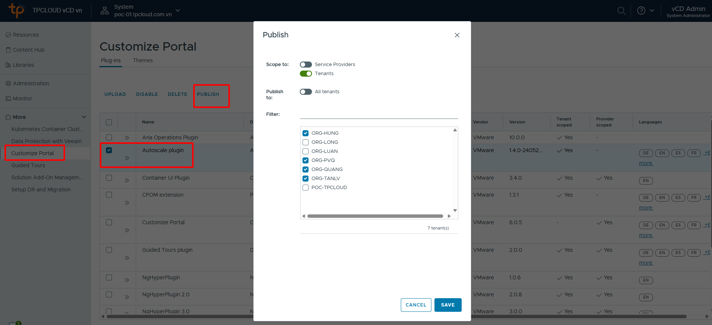

**Ý nghĩa bước này:** expose chức năng Scale Group từ Provider Portal xuống Tenant Portal.

## 2.2 Publish Rights Bundle

Publish Rights Bundle liên quan Scale Group, ví dụ:

```text
vmware:scalegroup Entitlement
```

cho tenant cần sử dụng.

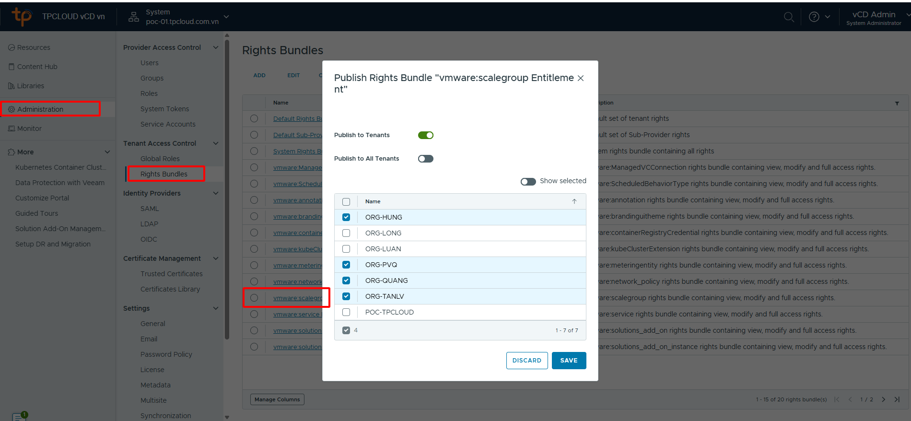

**Ý nghĩa:** cho phép tenant truy cập và thao tác với các API/object Scale Group.

Sau khi publish:

1. Logout/Login lại Tenant Portal.
2. Kiểm tra `Applications → Scale Groups`.
3. Nếu thấy tab nhưng `New Scale Group` không mở được, kiểm tra thêm Role của user và các quyền `VMWARE:SCALEGROUP`.

---

# 3. Chuẩn bị VM Template

Scale Group triển khai VM mới từ **vApp/VM Template trong Catalog**.

Template nên được chuẩn hóa trước khi dùng cho Auto Scale:

- Cài OS.
- Cài VMware Tools/open-vm-tools.
- Cài ứng dụng cần scale, ví dụ Nginx.
- Đảm bảo service tự start sau reboot.
- Kiểm tra Guest Customization/network customization.
- Không lưu dữ liệu quan trọng chỉ trên local disk nếu VM có thể bị Shrink.
- Shutdown VM sạch.
- Add to Catalog/Create vApp Template.


## 3.1 Chuẩn bị cấu hình DNS trong Template khi dùng ALB

Khi Scale Group được tạo với tùy chọn:

```text
I have set-up a Load Balancer
```

VCD có thể tự động tạo một backend Organization VDC Network riêng cho Scale Group dựa trên `Network CIDR` đã khai báo.

Trong môi trường PoC của tài liệu này, backend network do VCD sinh ra có:

- Gateway CIDR;
- Static IP Pool tương ứng với capacity của Scale Group;
- nhưng **không có Primary DNS/Secondary DNS được cấu hình**.

Nếu VM Template không có sẵn cấu hình DNS, VM mới được clone từ Template vẫn có thể nhận đúng IP Address và Default Gateway qua VMware Guest Customization nhưng không có DNS resolver để phân giải hostname/domain.

Ví dụ VM có thể truy cập Internet bằng IP:

```bash
ping 8.8.8.8
```

nhưng các thao tác phụ thuộc DNS như sau có thể thất bại:

```bash
ping google.com
apt update
curl https://example.com
```

### Cách xử lý

Trước khi shutdown VM nguồn và chuyển thành Template, tạo một file Netplan riêng chỉ chứa cấu hình `nameservers`.

> **Không cấu hình IP Address, Prefix hoặc Default Gateway cố định trong file này.** Các thông tin IP/Gateway của từng VM phải để VCD/VMware Guest Customization cấp động.

Ví dụ:

```bash
sudo vi /etc/netplan/dns.yaml
```

Nội dung:

```yaml
network:
  version: 2
  renderer: networkd
  ethernets:
    ens192:
      nameservers:
        addresses:
          - 8.8.8.8
          - 1.1.1.1
```

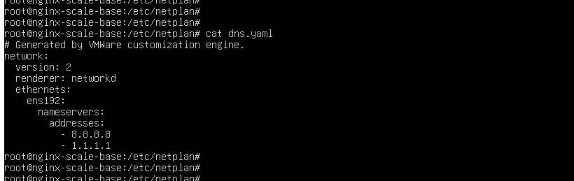

Kiểm tra syntax:

```bash
sudo netplan generate
```

Có thể kiểm tra cấu hình Netplan sau khi merge bằng:

```bash
sudo netplan get
```

### Cơ chế hoạt động khi VM mới được tạo

Sau khi Scale Group clone VM từ Template:

1. File `dns.yaml` có sẵn trong Template cung cấp thông tin DNS.
2. VMware Guest Customization sinh file Netplan khác để cấu hình IP Address, Prefix và Default Gateway của VM mới.
3. Netplan đọc các file `.yaml` trong `/etc/netplan/` và merge các thuộc tính của cùng interface.
4. VM mới nhận IP/Gateway từ VCD và giữ DNS đã chuẩn hóa trong Template.

Luồng cấu hình:

```text
Template
└── /etc/netplan/dns.yaml
    └── DNS: 8.8.8.8, 1.1.1.1
                 │
                 ▼
         Scale Group clone VM
                 │
                 ▼
VMware Guest Customization
└── IP Address / Prefix / Gateway
                 │
                 ▼
          Netplan merge
                 │
                 ▼
VM mới
├── IP/Gateway: do VCD cấp
└── DNS: lấy từ Template
```

Sau khi VM được Initial Grow/Grow, kiểm tra:

```bash
ip -br addr
ip route
resolvectl status ens192
sudo netplan get
getent hosts google.com
```

Kỳ vọng VM có:

- IP Address đúng từ backend Static IP Pool;
- Default Gateway đúng theo `Network CIDR`;
- DNS Server đã cấu hình trong Template;
- resolve hostname/domain thành công.

> **Lưu ý:** `8.8.8.8` và `1.1.1.1` chỉ là ví dụ. Trong môi trường Enterprise/Cloud Provider nên ưu tiên DNS Resolver nội bộ hoặc DNS Server được thiết kế cho workload.

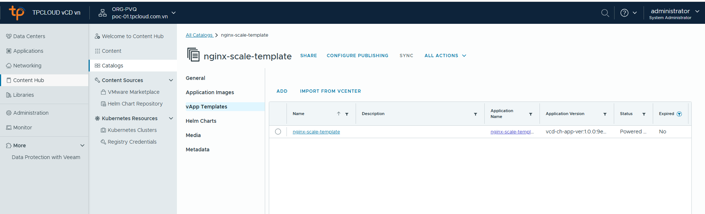

> **Khuyến nghị:** quản lý Template theo version, ví dụ `nginx-scale-template-v1`, `nginx-scale-template-v2`.

Việc chỉnh trực tiếp VM đang chạy **không tự cập nhật Template**. VM được Grow về sau luôn clone từ Template đang được gán cho Scale Group.

---

# 4. Mô hình 1 – I have a fully set-up network

Mô hình này sử dụng Organization VDC Network đã tồn tại.

VCD chịu trách nhiệm:

- tạo VM;
- xóa VM;
- duy trì số lượng Min/Max.

Việc phân phối traffic giữa các VM, nếu cần, do hệ thống khác hoặc ứng dụng tự xử lý.

## 4.1 Yêu cầu network

Network phải:

- đã tồn tại và attach đúng Org VDC;
- có **Static IP Pool** còn đủ IP cho ít nhất `Max VMs`;
- có gateway/DNS/routing/firewall phù hợp;
- không sử dụng Static Manual IP cố định trong template autoscale.

> **Quan trọng:** trong workflow không dùng ALB, VM Scale Group lấy IP từ **Static IP Pool** của Organization VDC Network.

Nếu IP Pool hết, Grow có thể thất bại hoặc VM mới không có network hợp lệ.

## 4.2 Tạo Scale Group

Vào:

```text
Applications → Scale Groups → New Scale Group
```

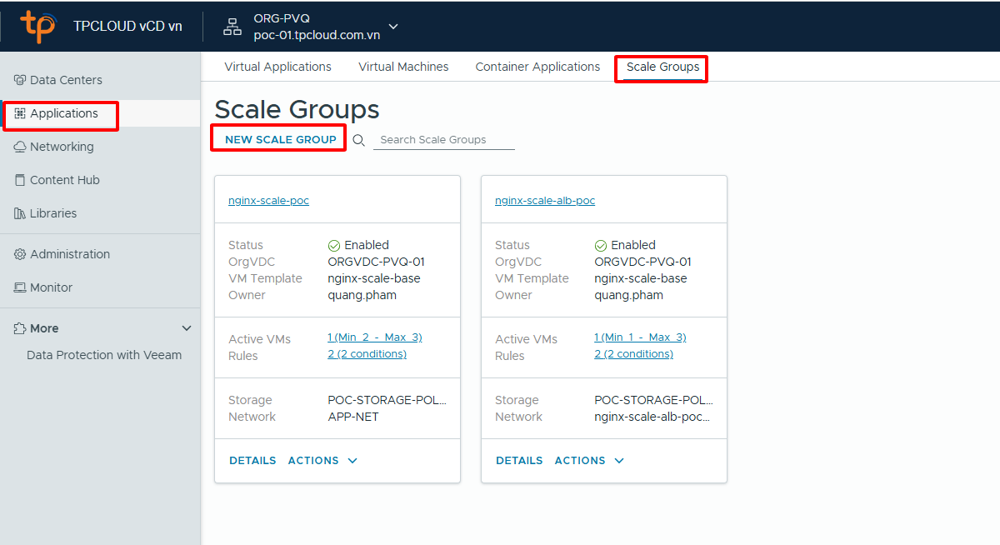

Cấu hình General Settings:

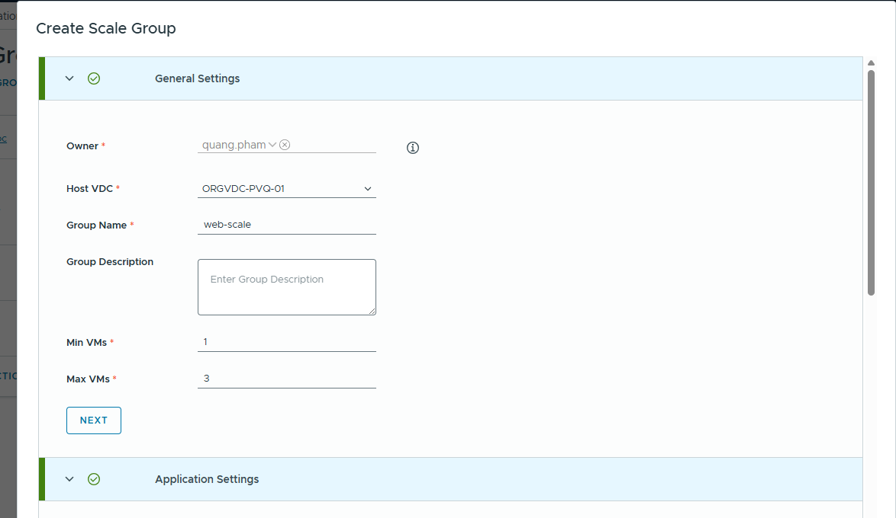

| Trường | Giải thích |
|---|---|
| **Host VDC** | Org VDC nơi các VM Scale Group được triển khai. |
| **Group Name** | Tên Scale Group; nên đặt theo ứng dụng/chức năng. |
| **Min VMs** | Baseline capacity. Ví dụ `Min=1` thì sau khi tạo group sẽ có 1 VM. |
| **Max VMs** | Capacity/quota tối đa. Ví dụ `Max=3` thì group không Grow quá 3 VM. |

## 4.3 Application Settings và Network

Chọn:

- đúng VM Template trong Catalog;
- Storage Policy;
- **I have a fully set-up network**;
- Organization VDC Network đã chuẩn bị Static IP Pool.

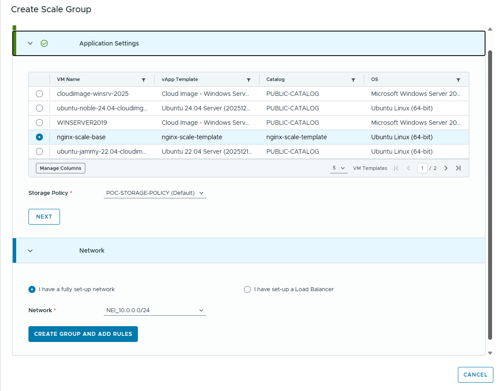

## 4.4 Initial Grow

Sau khi Create Group, VCD tự tạo task khởi tạo và triển khai VM đến mức `Min VMs`.

Vì vậy VM đầu tiên có thể xuất hiện **ngay cả khi chưa có Grow Rule**.

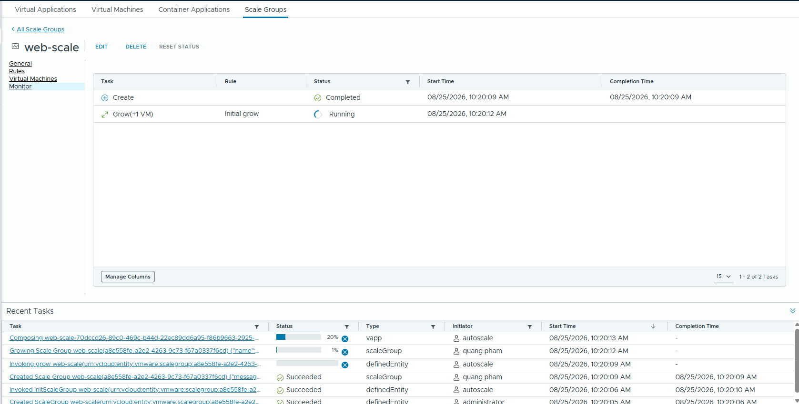

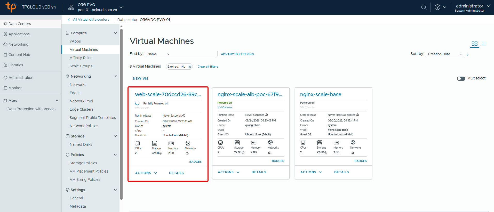

---

# 5. Cấu hình Rule Grow/Shrink

## 5.1 Grow Rule – scale out khi CPU cao

Grow Rule quyết định khi nào Scale Group tạo thêm VM.

Ví dụ PoC:

```text
Behavior: Grow
Number of VMs: 1
CPU usage >= 60–70%
Duration: 1 minute
Cooldown: 3–5 minutes
```

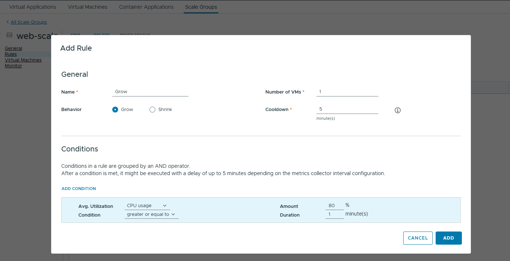

### Ý nghĩa các tham số

| Tham số | Ý nghĩa vận hành |
|---|---|
| **Behavior = Grow** | Deploy VM mới từ Template. |
| **Number of VMs** | Số VM tạo thêm mỗi lần Rule trigger. |
| **Cooldown** | Ngăn các lần Grow liên tiếp quá nhanh. |
| **Avg. Utilization = CPU usage** | Đánh giá mức CPU trung bình của các VM member. |
| **Condition >= threshold** | Rule chỉ trigger khi CPU đạt/vượt ngưỡng. |
| **Duration** | Điều kiện phải duy trì đủ thời gian trước khi thực thi. |

## 5.2 Shrink Rule – scale in khi CPU giảm

Grow Rule không tự suy ra chiều ngược lại; cần tạo Shrink Rule riêng.

Ví dụ:

```text
Behavior: Shrink
Number of VMs: 1
CPU usage <= 20–40%
Duration: 1 minute
Cooldown: 3–5 minutes
```

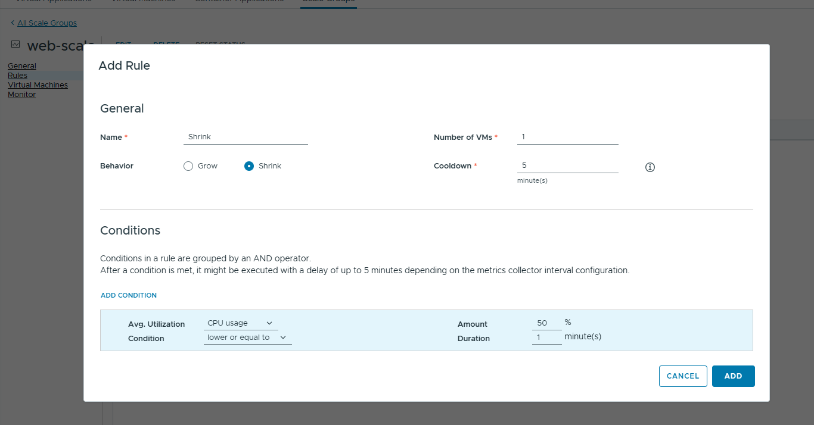

> Nên dùng threshold Shrink thấp hơn Grow để tạo **hysteresis**, tránh scale in/scale out liên tục.

Ví dụ:

```text
Grow   >= 60%
Shrink <= 20%
```

---

# 6. Kiểm thử Auto Scale với network đã cấu hình sẵn

## 6.1 Tạo CPU load để test Grow

Trên VM member của Scale Group, với VM 2 vCPU:

```bash
stress-ng --cpu 2 --cpu-method int64 --timeout 12m
```

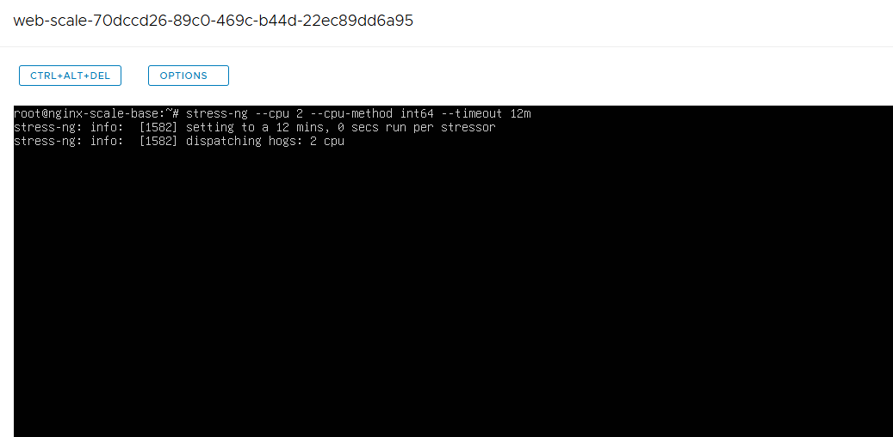

Theo dõi CPU:

```bash
top
```

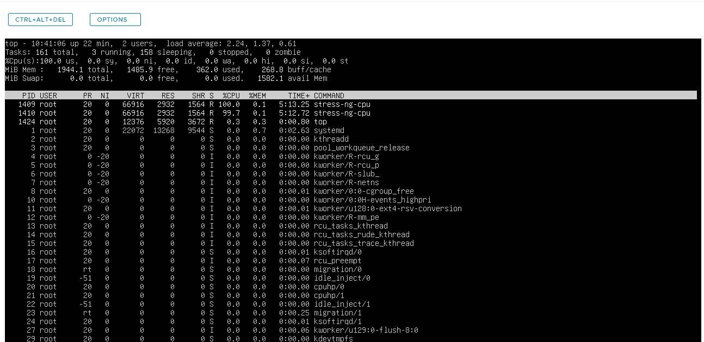

Giữ CPU trên threshold lâu hơn Duration.

> Metric collector và rule evaluator có chu kỳ riêng, vì vậy task Grow có thể xuất hiện trễ thêm vài phút so với Duration.

## 6.2 Xác nhận Grow thành công

Kiểm tra:

```text
Scale Group → Monitor
```

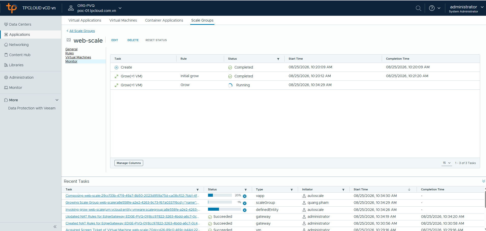

Sau đó kiểm tra VM mới:

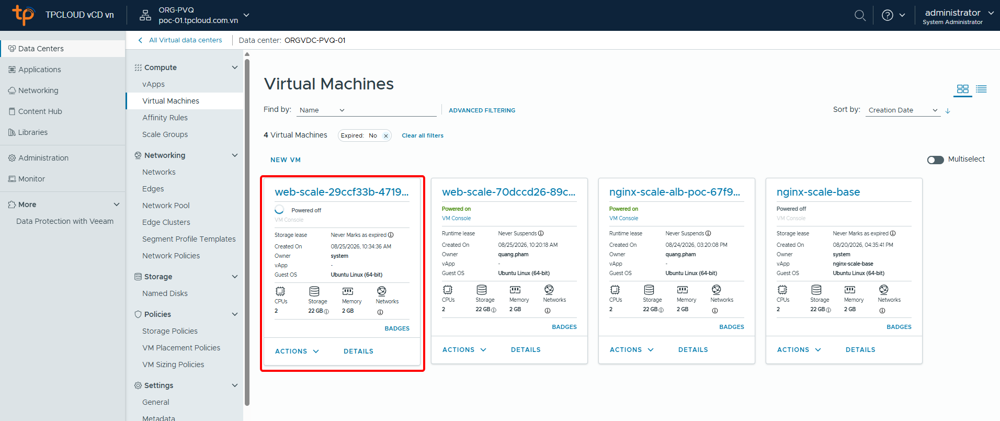

## 6.3 Xác nhận Shrink

Dừng workload/stress:

```bash
pkill -f stress-ng
```

Khi CPU trung bình giảm dưới threshold Shrink và Duration/Cooldown được thỏa mãn, VCD tạo task Shrink và thu hồi VM.

Scale Group không giảm xuống dưới `Min VMs`.

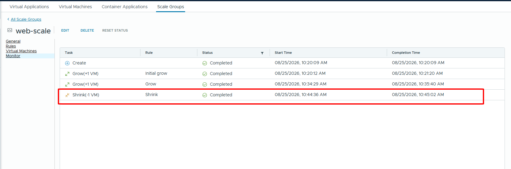

---

# 7. Mô hình 2 – I have set-up a Load Balancer

Mô hình này tích hợp Scale Group với **NSX Advanced Load Balancer (ALB/Avi)**.

ALB chịu trách nhiệm:

- VIP;
- Server Pool;
- Health Monitor;
- phân phối traffic.

Scale Group chịu trách nhiệm:

- tạo VM;
- xóa VM;
- duy trì Min/Max;
- Grow/Shrink theo Rule.

## 7.1 Thành phần

| Thành phần | Vai trò |
|---|---|
| **Edge Gateway** | Kết nối Org VDC/NSX và cung cấp context cho Load Balancer. |
| **Service Engine Group** | Compute runtime của ALB để triển khai Virtual Service. |
| **Server Pool** | Tập backend IP mà Virtual Service có thể forward traffic tới. |
| **Virtual Service** | VIP/port tiếp nhận traffic client. |
| **Health Monitor** | Xác định backend nào thực sự sẵn sàng. |
| **Scale Group** | Quản lý lifecycle VM dựa trên Rule và Min/Max. |

## 7.2 Tạo Load Balancer Pool

Tạo Server Pool trước khi tạo Scale Group.

Cấu hình PoC ví dụ:

```text
Load Balancer Algorithm: Round Robin
Default Server Port: 80
State: Enabled
```

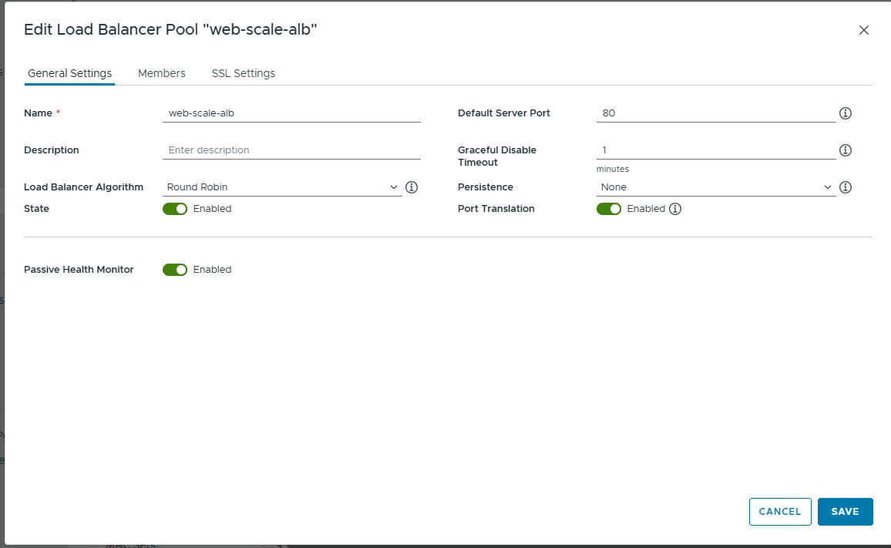

Không add thủ công từng VM vào pool.

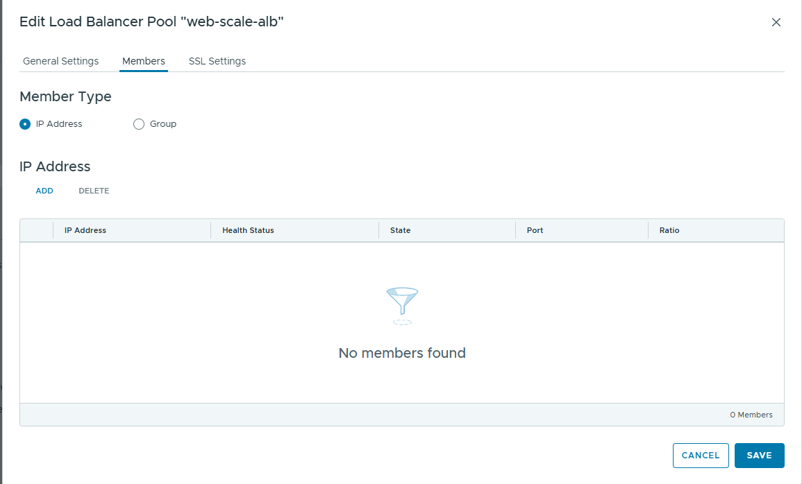

## 7.3 Tạo Virtual Service

Tạo Virtual Service và trỏ tới Server Pool.

Chọn:

- Service Engine Group;
- Server Pool;
- VIP;
- Service Type;
- Port.

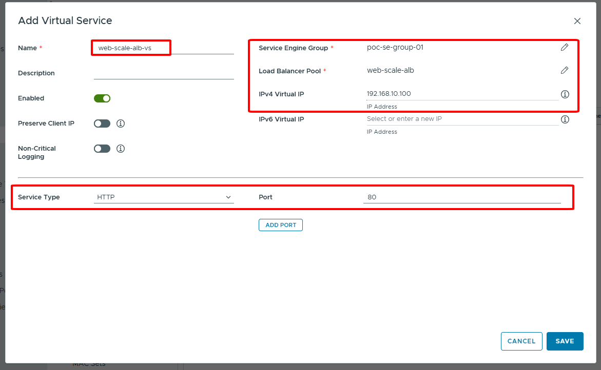

Ví dụ Nginx HTTP PoC:

```text
Service Type: HTTP
Port: 80
```

### Khuyến nghị SSL

Đối với Scale Group production, nên terminate public TLS tại ALB để quản lý certificate tập trung và tránh phải phân phối private key tới từng VM autoscale.

Nếu cần end-to-end encryption, có thể dùng TLS re-encryption tới backend.

## 7.4 Tạo Scale Group với ALB

General Settings tương tự mô hình network thường.

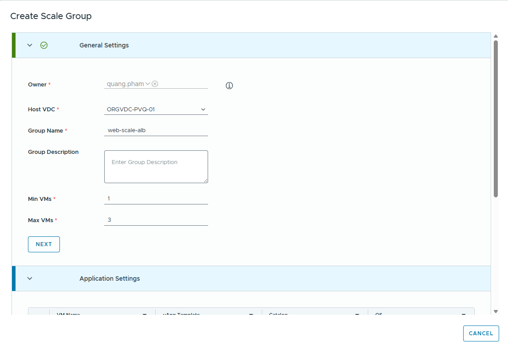

Tại Network chọn:

```text
I have set-up a Load Balancer
```

sau đó khai báo:

- Network CIDR;
- Edge Gateway;
- Server Pool.

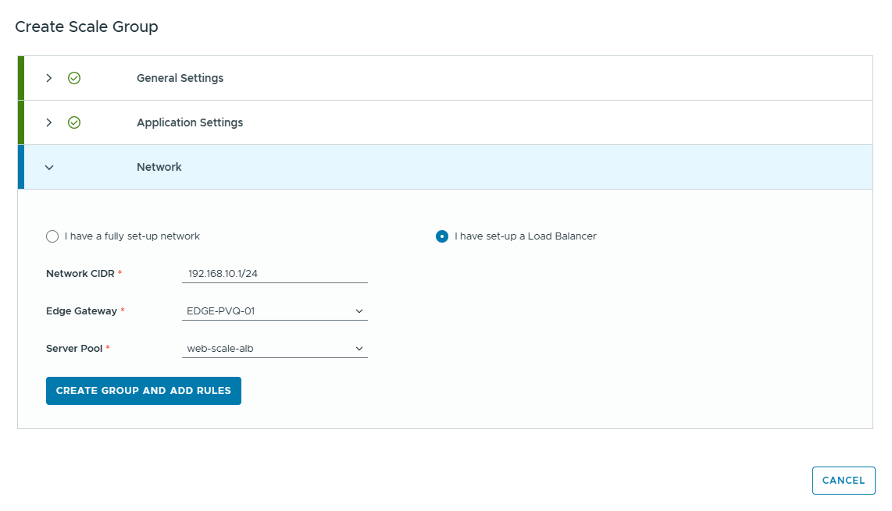

### Ý nghĩa Network CIDR

`Network CIDR` là backend network mới dành cho Scale Group.

Yêu cầu:

- quy hoạch trước;
- chưa tồn tại;
- không overlap với network đang có.

VCD sẽ tạo/attach network khi khởi tạo Scale Group.

> **Không nhập CIDR đang tồn tại.** Nếu CIDR trùng Organization VDC Network hiện hữu, task Create có thể fail với lỗi overlap subnet.

## 7.5 Initial Grow và backend network

Sau khi Create:

1. VCD khởi tạo backend network.
2. Liên kết ALB.
3. Initial Grow để đạt `Min VMs`.
4. VM member nhận IP từ backend range do Scale Group quản lý.

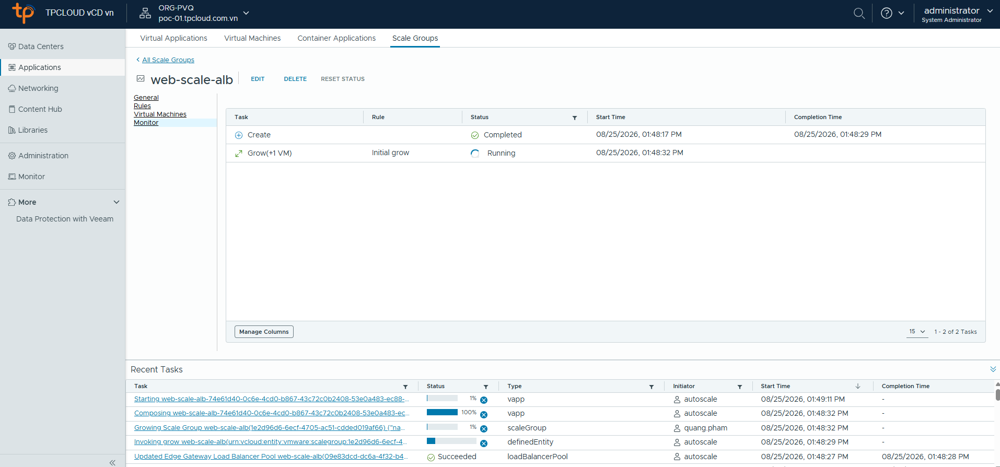

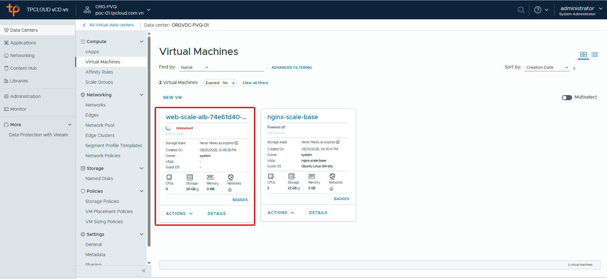

## 7.6 Pool member và vai trò của Health Monitor

Pool có thể được **pre-populate** các backend IP tương ứng với `Max VMs`.

Ví dụ:

```text
Max VMs = 3
```

thì Pool có thể xuất hiện trước 3 backend IP, trong khi ban đầu chỉ có 1 VM thực sự chạy.

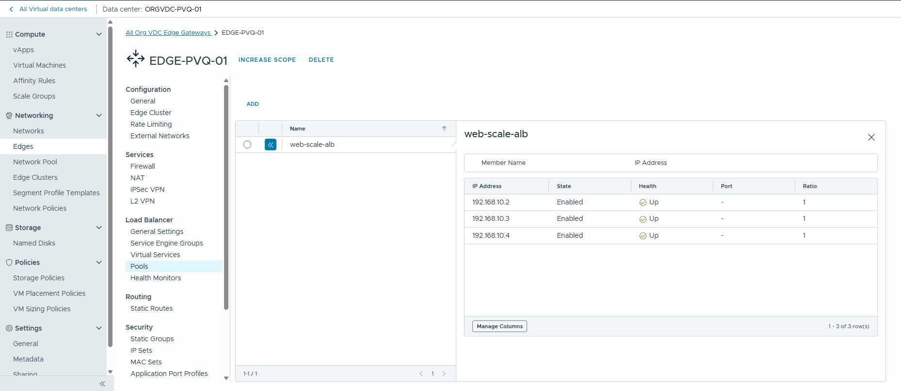

### Tại sao cần Health Monitor?

Nếu không có active Health Monitor, các IP chưa có VM/service vẫn có thể được xem là usable.

ALB có thể gửi traffic tới backend không hoạt động.

Health Monitor giúp phân biệt:

- **UP:** backend có VM/service đang chạy và trả lời probe hợp lệ.
- **DOWN:** IP đã reserve/pre-populate nhưng chưa có VM hoặc service chưa sẵn sàng.

Trong PoC của tài liệu, Health Monitor được assign **sau khi Scale Group Create thành công**.

Lý do: khi assign monitor trước, quá trình init từng gặp lỗi:

```text
Load Balancer Health Monitor Assignment is not supported with legacy API.
Please use new Health Monitor assignment API for assignment.
```

Vì vậy cần kiểm tra behavior theo VCD build hiện tại trước khi áp dụng production.

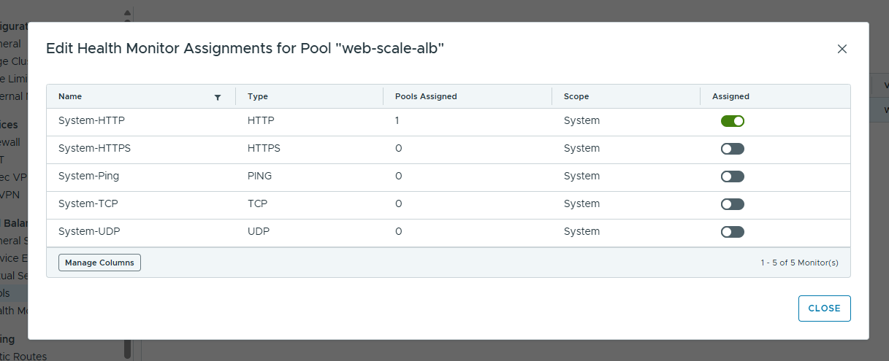

### Lifecycle backend IP

```text
VM Grow
  ↓
VM/Nginx start
  ↓
Health Monitor pass
  ↓
Backend IP: DOWN → UP
  ↓
ALB bắt đầu gửi traffic
```

Khi Shrink:

```text
VM bị thu hồi
  ↓
Health Monitor fail
  ↓
Backend IP: UP → DOWN
  ↓
ALB ngừng gửi traffic
```

## 7.7 Rule Grow/Shrink trong mô hình ALB

Rule CPU không thay đổi so với mô hình network thường.

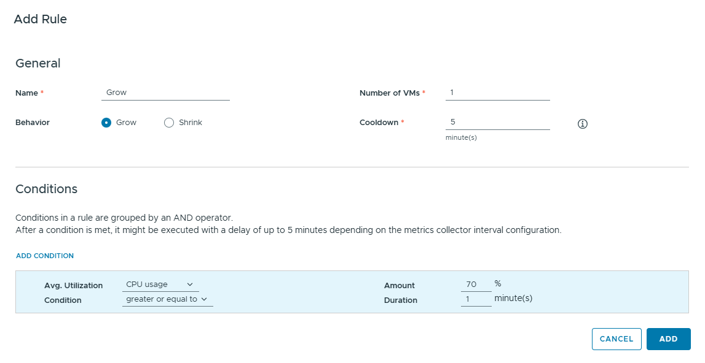

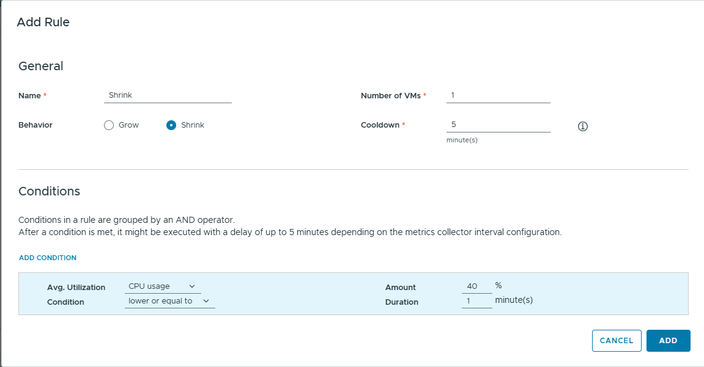

Điểm khác là ALB Health Monitor tự quyết định backend nào nhận traffic sau Grow/Shrink.

## 7.8 Kiểm thử Grow/Shrink với ALB

Tạo CPU load:

```bash
stress-ng --cpu 2 --cpu-method int64 --timeout 12m
```

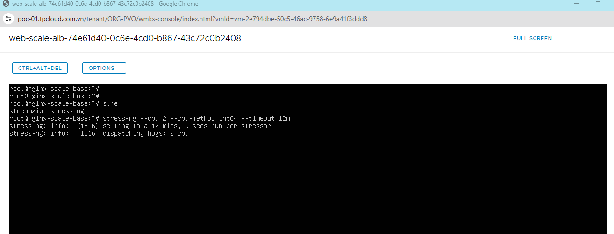

Sau Grow, kiểm tra đồng thời:

1. `Scale Group → Monitor`
2. `Scale Group → Virtual Machines`
3. `Edge Gateway → Load Balancer → Pools`

Member mới phải chuyển:

```text
DOWN → UP
```

sau khi VM/Nginx sẵn sàng.

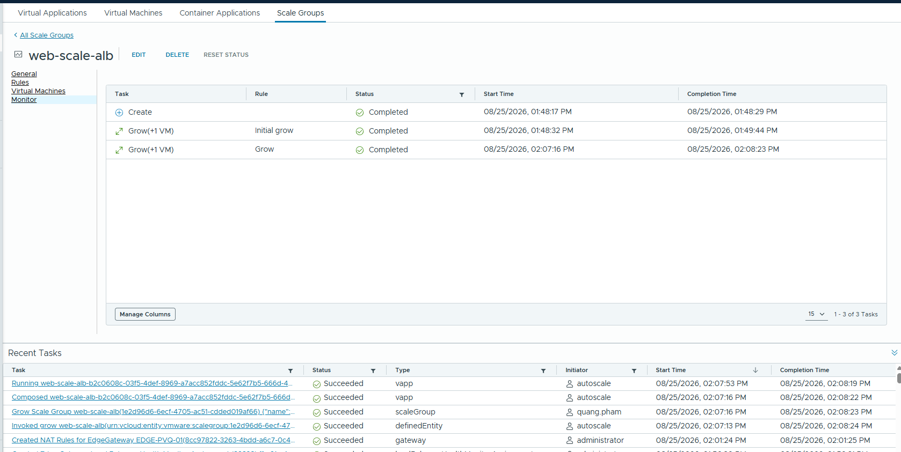

Sau khi dừng CPU load và CPU trung bình xuống dưới threshold Shrink:

- VCD thu hồi VM;
- Health Monitor đánh dấu backend tương ứng DOWN;
- ALB ngừng gửi traffic tới backend đó.

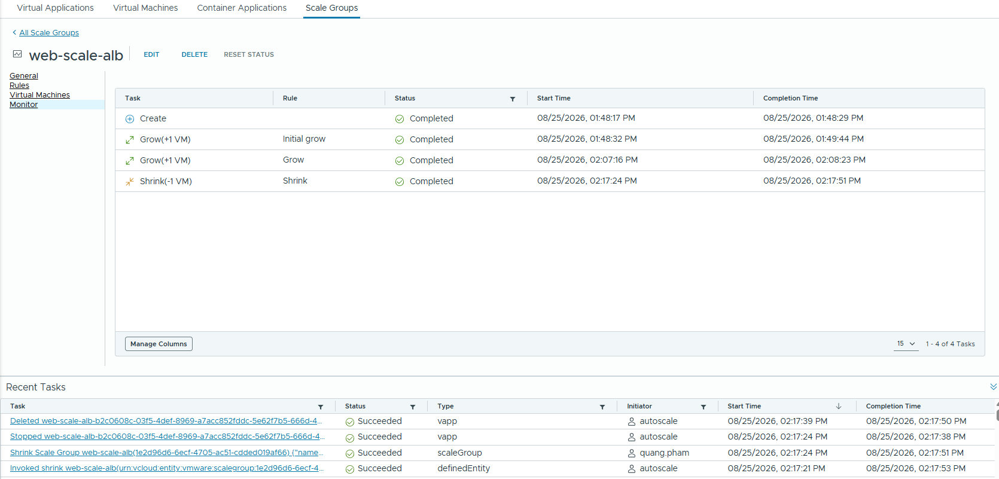

---

# 8. Checklist vận hành

## 8.1 Trước khi tạo Scale Group

- [ ] Scale Group UI/plug-in đã publish cho tenant.
- [ ] Rights Bundle đã publish.
- [ ] User Role có quyền Scale Group.
- [ ] VM Template đã chuẩn hóa.
- [ ] VMware Tools/open-vm-tools hoạt động.
- [ ] Application tự start sau reboot.
- [ ] Min/Max VMs phù hợp quota.
- [ ] Grow/Shrink threshold đã xác định.

## 8.2 Nếu dùng fully set-up network

- [ ] Org VDC Network đã tồn tại.
- [ ] Static IP Pool đủ cho Max VMs.
- [ ] Gateway/DNS/routing/firewall hợp lệ.
- [ ] Template không dùng Static Manual IP cố định.

## 8.3 Nếu dùng ALB

- [ ] Edge Gateway đã sẵn sàng.
- [ ] Service Engine Group đã assign.
- [ ] Server Pool đã tạo.
- [ ] Virtual Service đã tạo.
- [ ] Network CIDR mới không overlap.
- [ ] Health Monitor được cấu hình phù hợp.
- [ ] Backend port khớp với Nginx/application.

## 8.4 Sau khi tạo

- [ ] Task Create Completed.
- [ ] Initial Grow Completed.
- [ ] VM member có IP đúng.
- [ ] Nginx/application active.
- [ ] Grow Rule tạo VM mới.
- [ ] Shrink Rule thu hồi VM.
- [ ] Không Shrink dưới Min VMs.
- [ ] Với ALB: backend mới chuyển DOWN → UP sau Grow.
- [ ] Với ALB: backend bị thu hồi chuyển UP → DOWN sau Shrink.

---

# 9. Troubleshooting nhanh

## Scale Group tab không xuất hiện

Kiểm tra:

- plug-in/UI đã publish;
- Rights Bundle;
- Role `VMWARE:SCALEGROUP`;
- logout/login lại Tenant Portal.

## New Scale Group mở lỗi

Kiểm tra quyền tenant và initialization của Auto Scale feature.

## Grow không chạy

Kiểm tra:

- CPU có thực sự vượt threshold;
- Duration;
- Cooldown;
- Scale Group đã đạt Max VMs chưa;
- metric collector có delay;
- Monitor có task Grow hay không.

## Shrink không chạy

Kiểm tra:

- operator có đúng là `lower or equal to`;
- CPU trung bình group đã xuống threshold chưa;
- Cooldown;
- Scale Group đã ở Min VMs chưa.

Ví dụ cấu hình sai:

```text
Behavior: Shrink
Condition: CPU >= 60%
```

CPU thấp sẽ không bao giờ thỏa condition này.

## Tạo Scale Group ALB bị overlap subnet

Không dùng CIDR trùng network đã tồn tại.

Ví dụ:

```text
Existing APP-NET: 10.10.20.0/24
```

không dùng lại:

```text
Network CIDR: 10.10.20.1/24
```

Hãy quy hoạch một backend CIDR mới.

## Pool có nhiều IP hơn số VM đang chạy

Đây có thể là behavior pre-populate theo `Max VMs`.

Health Monitor cần đảm bảo:

```text
IP có VM/service → UP
IP chưa có VM    → DOWN
```

## Thay đổi trực tiếp VM member

Thay đổi trực tiếp VM đang chạy không cập nhật Template.

VM được Grow sau đó vẫn clone từ Template cũ.

Do đó nên quản lý Template theo version và cập nhật Scale Group theo quy trình change control.

---

## Kết luận

Scale Group trong VMware Cloud Director cung cấp horizontal autoscaling cho workload VM.

Hai mô hình chính:

```text
1. Fully set-up network
   → dùng Organization VDC Network có sẵn
   → cần Static IP Pool
   → không bắt buộc ALB

2. Load Balancer
   → tích hợp VCD + NSX ALB
   → backend network được Scale Group quản lý
   → Health Monitor quyết định backend thực sự nhận traffic
```

Đối với workload Web/API production, mô hình ALB phù hợp hơn khi cần tự động phân phối traffic theo lifecycle Grow/Shrink của Scale Group.
